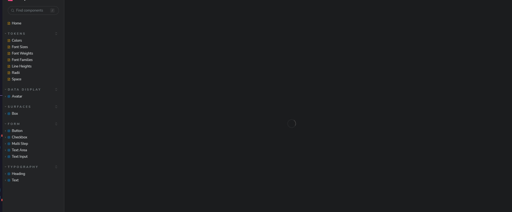
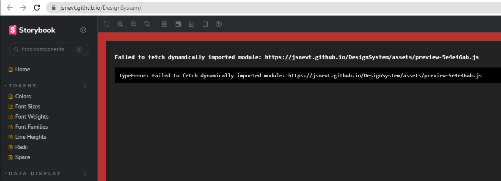
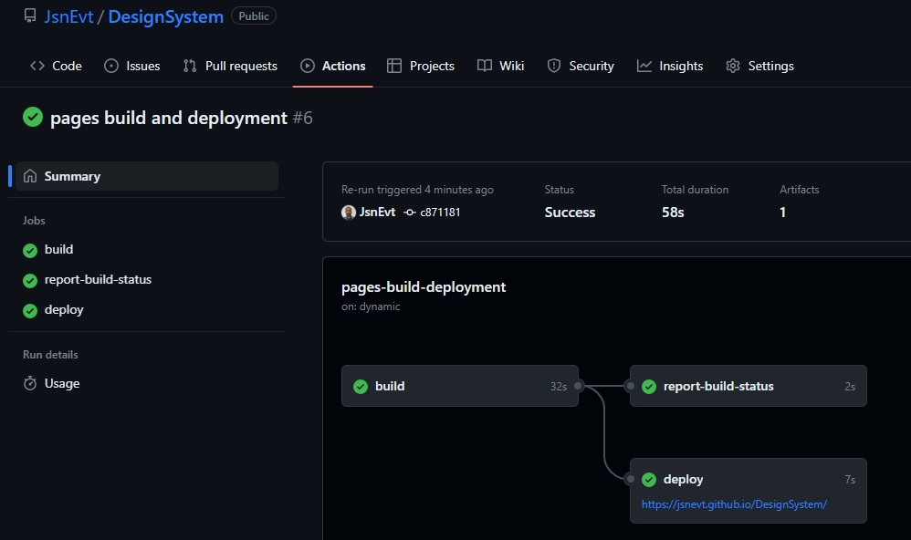

<h1 align="center">
  
</h1>
<h4 align="center"> 
	🚀 Aplicação finalizada 🚀
</h4>

<p align="center">
 <a href="#-about">About</a> |
 <a href="#-functionalities">Functionalities</a> |
 <a href="#-layout">Layout</a> | 
 <a href="#-how-it-works">How It Works</a> | 
 <a href="#-technologies">Technologies</a> | 
 <a href="#-author">Author</a> | 
 <a href="#-license">License</a>
</p>

## 💻 About

Neste projeto, construímos um Design System em formato de `monorepo`, documentando `tokens` (cores, tamanhos de fonte, espaçamento, etc.) e `componentes` React com a ferramenta `Storybook`. Utilizamos o `turbo-repo` para automatizar o processo de build dos pacotes, garantindo eficiência e escalabilidade. Com o `changeset`, facilitamos a atualização e publicação dos pacotes no `npm`, mantendo um histórico claro das alterações. Essa abordagem promove reutilização, padronização e colaboração entre diferentes projetos.

Vale ressaltar que este projeto foi desenvolvido como conclusão de um desafio proposto no curso/trilha **Ignite** oferecido pela [Rocketseat](https://www.rocketseat.com.br/).

---
## ⚙ Functionalities
- [x] Pacote com as configurações base do ESLint na aplicação
- [x] Pacote com as configurações base do TypeScript na aplicação
- [x] Pacote de tokens e documentação com Storybook
  - [x] colors
  - [x] fonts
  - [x] font-sizes
  - [x] font-weights
  - [x] line-heights
  - [x] radii
  - [x] space
- [x] Criação componentes React e documentação com Storybook
  - [x] Text
  - [x] Heading (Títulos, subtítulos)
  - [x] Box / Card
  - [x] Button
  - [x] TextInput
  - [x] TextArea
  - [x] Checkbox
  - [x] Avatar
  - [x] MultiStep (indicador de etapas de preenchimento de algo, ex: formulário)
  - [x] Tooltip
  - [x] Toast

---

## 🎨 Layout

Você pode visualizar o layout do projeto no qual nos baseamos para criar o Design System através [desse link](https://www.figma.com/file/cowwFHJimoyQomSAynMjGz/Ignite-Call?node-id=4:412). É necessário ter conta no [Figma](https://www.figma.com/) para acessá-lo.

Veja algumas fotos do projeto, inclusive erros que deparei durante o processo:

### No_contents

<p align="center">
  
</p>

### Erro

<p align="center">
  
</p>


### Deploy

<p align="center">
  
</p>


## 🚀 How it works

### Pré-requisitos

Antes de baixar o projeto você vai precisar ter instalado na sua máquina as seguintes ferramentas:

* [Git](https://git-scm.com)
* [NodeJS](https://nodejs.org/en/)
* [Yarn](https://yarnpkg.com/) ou [NPM](https://www.npmjs.com/)

Além disto é bom ter um editor para trabalhar com o código como [VSCode](https://code.visualstudio.com/)

### Clonando e Executando

Passo a passo para clonar e executar a aplicação na sua máquina:

```bash
# Clone este repositório
$ git clone https://github.com/JsnEvt/Design_System_Desafio.git

# Acesse a pasta do projeto no terminal
$ cd DesignSystem_Desafio

# Instale as dependências
$ npm install

# Execute a aplicação em modo de desenvolvimento
$ npm run dev

# O documentação Storybook inciará abrindo uma aba no navegador em alguma porta disponível  
```

---

## 🛠 Technologies

As seguintes principais ferramentas foram usadas na construção do projeto:

- **[TypeScript](https://www.typescriptlang.org/)**
- **[React](https://react.dev/)**
- **[Storybook](https://storybook.js.org/)**
- **[Stitches](https://stitches.dev/)**
- **[Radix UI](https://www.radix-ui.com/)**
- **[Turborepo](https://turbo.build/repo)**
- **[Changeset](https://github.com/changesets/changesets)**

### Instrutor: CTO da [Rocketseat](https://rocketseat.com.br/) :rocket: Diego Fernandes
<td align="center"><a href="https://rocketseat.com.br"><br /><sub><b>Diego Fernandes</b></sub>
</a><br /><a href="https://rocketseat.com.br/" title="Rocketseat"></a></td>

- ## 🦸 Autor

[](https://www.linkedin.com/in/jason-everton/)

[](mailto:jasonemsw10@gmail.com)

Feito por Jason Everton 👋🏽 [Entre em contato!](https://www.linkedin.com/in/jason-everton)

## 📝 License

Este projeto está sob a licença MIT.


